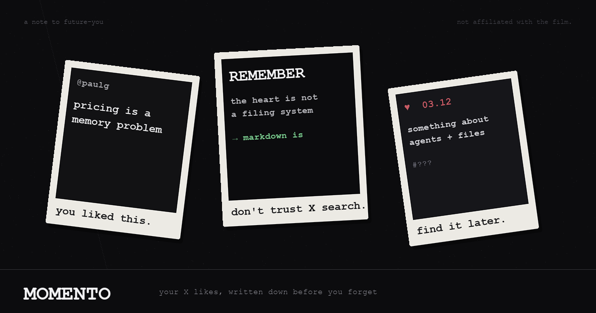

# momento

> Remember everything you heart, bookmark, or share from X.



<p align="center"><sub>Like the film: you won't remember. Write it down.<br/>Not affiliated with <i>Memento</i> (2000) — just stealing the bit about external memory.</sub></p>

Momento brings **X Hearts + Bookmarks** into one searchable archive without flattening the distinction. The same tweet can be both; it still appears once.

- Mobile-first web app
- Chrome extension for bulk Hearts and Bookmarks sync
- Add a tweet from your phone by URL or share target
- Natural keyword recall: `that tweet about pricing`
- Optional QMD hybrid lexical + semantic search
- Grounded local answers with citations via llama.cpp
- Reverse-chronological source timelines
- Plain markdown mirror for Obsidian and local agents
- Local-first: browser cookies never leave the extension

## Interface

The mobile PWA uses the requested shadcn preset:

```bash
bunx --bun shadcn@latest init --preset b3Zheoix4U --template next
```

It lives in [`web/`](./web): Next.js 16, Base UI primitives, the `base-sera` style, stone tokens, Oxanium/Geist type, and Phosphor icons. The production export is committed so `momento serve` stays zero-dependency.

## Quick start

Requires Node 20+ and Chrome/Arc/Brave/Edge.

```bash
git clone https://github.com/gvkhosla/momento.git
cd momento
npm link
momento seed      # optional demo archive
momento serve
```

Open [http://localhost:4177](http://localhost:4177).

## Sync X Hearts + Bookmarks

1. Download `momento-extension-v0.3.0.zip` from the [latest release](https://github.com/gvkhosla/momento/releases/latest) and unzip it—or use the local `momento/extension` folder
2. Open `chrome://extensions`
3. Enable **Developer mode**
4. **Load unpacked** → select the unzipped extension folder
5. Stay signed in at [x.com](https://x.com)
6. Open the Momento extension
7. Select **Bookmarks**, **Hearts**, or both → **Sync selected**

If X config capture fails, open your Hearts or Bookmarks page once, let it load, then retry.

## Use it on your phone

Create a temporary secure URL to the archive running on your Mac:

```bash
momento phone
```

Open the printed HTTPS URL on your phone. Keep the terminal open.

From there you can:

- Search your whole archive
- Filter Bookmarks, Hearts, and Shared items
- Add an X URL directly
- Install Momento to your Home Screen
- Share into Momento on browsers that support PWA share targets

Your archive still lives at `~/momento-vault`; the tunnel only exposes the running app while the command is open.

> For a permanent multi-user cloud product, Momento needs accounts and an encrypted sync backend. This release deliberately keeps your X session and archive local.

## Search and local answers

Instant keyword search remains the default:

```bash
momento search "the thread about usage pricing"
momento search "design systems" --source bookmark
```

Optional deep search uses QMD's BM25 + vector retrieval and rank fusion. Momento does not index private files or download models automatically:

```bash
momento deep-setup

# Run the printed commands yourself once, then:
momento search "charging customers based on usage" --deep
```

`--deep` sends a structured `lex` + `vec` query to QMD and skips query expansion and reranking by default, keeping the optional footprint to the embedding model. Add `--rerank` when you want slower local reranking.

A small local answer engine retrieves saved posts, then asks a GGUF instruct model to synthesize only from that evidence with numbered citations:

```bash
brew install llama.cpp
export MOMENTO_MODEL=~/models/your-instruct-model.gguf
momento ask "What patterns have I saved about reliable agents?"
momento ask "Summarize what I saved about pricing" --source bookmark
```

Momento automatically chooses the smallest `.gguf` in `~/models` when `MOMENTO_MODEL` is unset. QMD is preferred for evidence when configured; otherwise `ask` falls back to keyword evidence.

```bash
momento stats
momento path
momento open
```

## What is stored

Each unique tweet becomes one markdown file:

```markdown
---
id: "1900123456789012345"
url: https://x.com/paulg/status/1900123456789012345
author: "@paulg"
author_name: Paul Graham
date: 2025-03-12T14:22:00.000Z
saved_at: 2026-07-28T08:30:00.000Z
sources: ["heart", "bookmark"]
liked_at: 2026-07-27T20:10:00.000Z
bookmarked_at: 2026-07-28T08:30:00.000Z
---

The best founders are relentlessly resourceful.
```

Archive layout:

```text
~/momento-vault/
├── items.json       # canonical merged archive
├── README.md
└── by-id/           # agent/Obsidian-friendly markdown
```

## Phone capture

The PWA declares a Web Share Target. You can also paste a tweet URL into **Add a link** and choose whether to remember it as a Bookmark or Heart.

For an iOS Shortcut, create a Share Sheet shortcut that:

1. Receives **URLs** from the Share Sheet
2. Uses **Get Contents of URL** on `https://YOUR_TUNNEL/api/capture?token=YOUR_PAIRING_TOKEN`
3. Method: `POST`
4. JSON body: `{ "url": "Shortcut Input", "source": "bookmark" }`

Copy the tunnel host and pairing token from the URL printed by `momento phone`.

The temporary `trycloudflare.com` URL and pairing token change each time. A permanent hosted version will remove that limitation.

## Agent skill

Drop [`skill/SKILL.md`](./skill/SKILL.md) into your agent skills directory. Then ask:

> Find the tweet I bookmarked about usage-based pricing.

The agent uses `momento search` or reads `~/momento-vault/by-id`.

## Commands

| Command | Job |
|---|---|
| `momento serve` | Run the PWA and local sync API |
| `momento phone` | Create a secure temporary phone URL |
| `momento search <query>` | Instant keyword search |
| `momento search <query> --deep` | QMD hybrid lexical + vector search |
| `momento ask <question>` | Answer locally from cited saved posts |
| `momento deep-setup` | Print manual QMD setup/refresh commands |
| `momento repair-order --source TYPE` | Repair ordering from pre-v0.3 imports |
| `momento stats` | Count unique items and sources |
| `momento seed` | Add four demo memories |
| `momento clear-demo` | Remove demo memories |
| `momento path` | Print the vault path |
| `momento open` | Open the vault |

## Privacy and constraints

- X cookies remain inside the browser extension
- The extension talks to `127.0.0.1:4177`
- Sync uses X's private web GraphQL endpoints, so X can change them
- Momento sniffs live query IDs to reduce breakage
- X omits exact save timestamps; Momento preserves the source timeline order using stable synthetic timestamps
- QMD indexing and local model downloads are always explicit opt-ins
- Phone tunnels should be treated as temporary personal links

## Development

```bash
npm test
npm run check
MOMENTO_HOME=/tmp/momento-dev momento serve
```

## License

MIT
